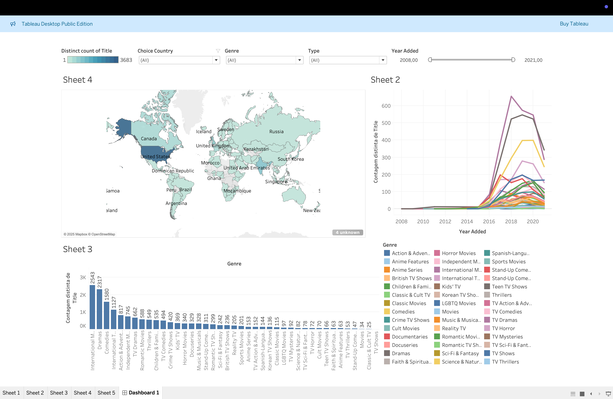
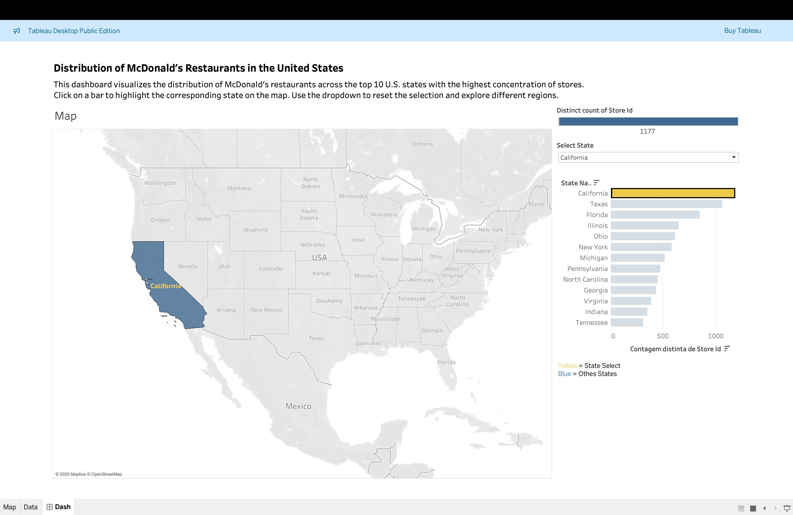

# 📊 Tableau Projects Portfolio

Welcome to my interactive data visualization portfolio!  
Here you'll find Tableau dashboards based on real-world datasets, with storytelling, strategic insights, and global analysis.

---

## 🔶 Netflix Global Content Trends (2008–2021)

📁 [`netflix-global-analysis/`](./netflix-global-analysis)  
🎯 **Goal**: Analyze how Netflix expanded its catalog worldwide, by country, genre, and type of content.  
✅ Highlights: interactive map, time series chart, genre breakdown by country, filters for dynamic exploration.  
🔗 [View on Tableau Public](https://public.tableau.com/app/profile/adilson.rodrigues)  

---

## 🔶 McDonald's Store Distribution in the USA

📁 [`mcdonalds-store-distribution/`](./mcdonalds-store-distribution)  
🎯 **Goal**: Explore the geographic distribution of McDonald's locations across U.S. states.  
✅ Highlights: map by state, bar chart for top 10, parameter actions for dynamic highlights.  
🔗 [View on Tableau Public](https://public.tableau.com/app/profile/adilson.rodrigues)  

---

👩‍💻 Created by **Adilson Rodrigues**  
🔗 [LinkedIn](https://www.linkedin.com/in/adilsonjvr/) • 📧 adilsonjvr@gmail.com or adilsonjvr@gmail.com
